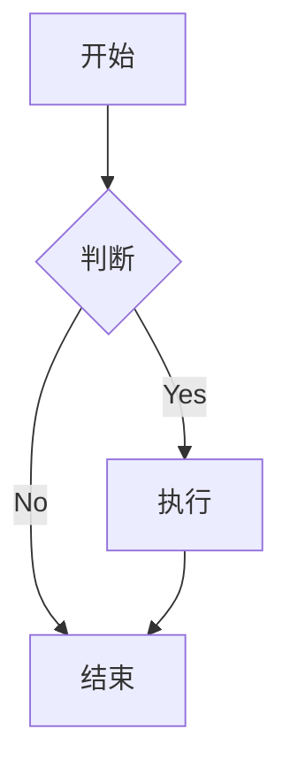
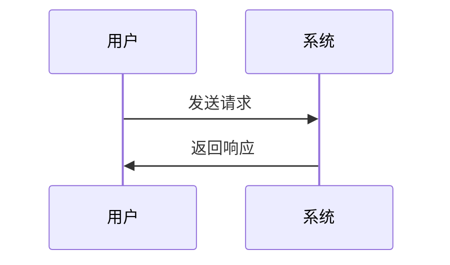

# Markdown 编辑器

一个支持 Mermaid 图表的 Markdown 编辑器，使用 React 和 TypeScript 构建。

## 功能特点

- 实时预览 Markdown 内容
- 支持 Mermaid 图表渲染
- 分屏编辑模式
- 响应式设计

## 支持的图表类型

- 流程图 (graph TD)
- 时序图 (sequenceDiagram)
- 甘特图 (gantt)
- 饼图 (pie)
- 类图 (classDiagram)
- 状态图 (stateDiagram-v2)
- 实体关系图 (erDiagram)

## 开始使用

1. 克隆仓库：
```bash
git clone [repository-url]
```

2. 安装依赖：
```bash
npm install
```

3. 启动开发服务器：
```bash
npm start
```

4. 在浏览器中打开 http://localhost:3000

## 使用示例

```markdown
# 流程图示例



## 时序图示例


```

## 技术栈

- React
- TypeScript
- Mermaid.js
- React-Markdown
- React-Split

## 许可证

MIT