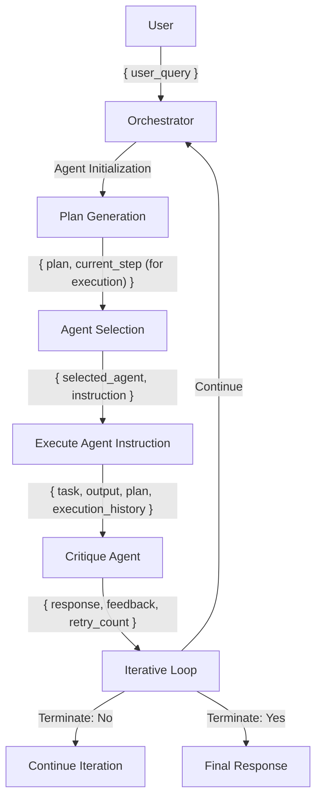
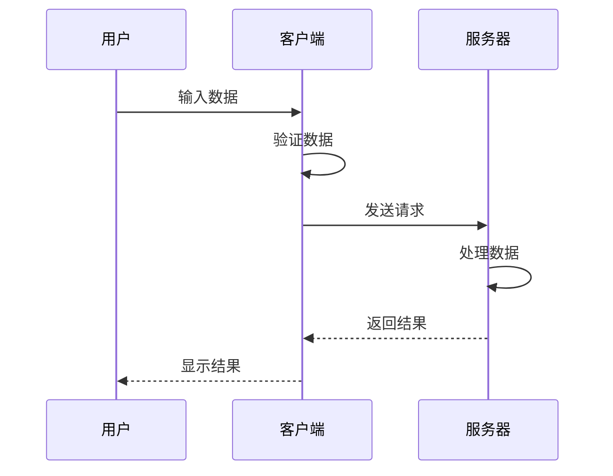
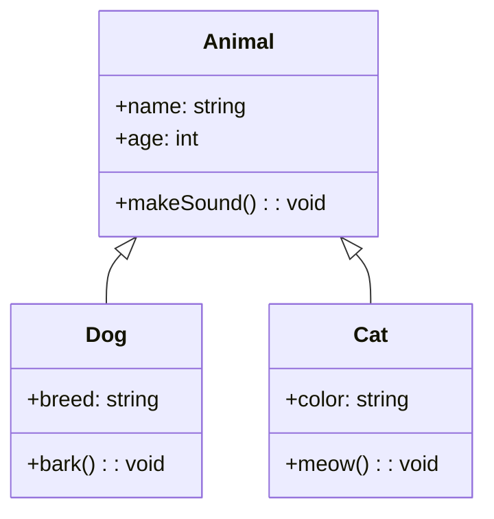

# Markdown 渲染器示例

这是一个 Markdown 渲染器的示例文件，展示了各种 Markdown 语法和特性。

## 1. 基本语法

### 1.1 文本格式化

- **粗体文本**
- *斜体文本*
- ~~删除线文本~~
- `行内代码`

### 1.2 列表

有序列表：
1. 第一项
2. 第二项
3. 第三项

无序列表：
- 苹果
- 香蕉
- 橙子

### 1.3 引用

> 这是一段引用文本
> 可以有多行
>> 也可以嵌套引用

## 2. 代码示例

### 2.1 JavaScript 代码

```javascript
function calculateFactorial(n) {
    if (n === 0 || n === 1) {
        return 1;
    }
    return n * calculateFactorial(n - 1);
}

console.log(calculateFactorial(5)); // 输出: 120
```

### 2.2 Python 代码

```python
def fibonacci(n):
    if n <= 1:
        return n
    return fibonacci(n-1) + fibonacci(n-2)

print([fibonacci(i) for i in range(10)])
```

### 2.3 命令行示例

```cmd
dir /s /b *.md
tree /F
```

```powershell
Get-Process | Where-Object { $_.CPU -gt 10 } | Sort-Object CPU -Descending
Get-ChildItem -Recurse | Where-Object { $_.Extension -eq '.md' }
```

## 3. 图表示例

### 3.1 流程图



### 3.2 时序图



### 3.3 类图



## 4. 表格示例

| 功能 | 状态 | 说明 |
|------|------|------|
| Markdown 渲染 | ✅ | 支持基本语法 |
| 代码高亮 | ✅ | 支持多种语言 |
| 流程图 | ✅ | 支持 Mermaid |
| 数学公式 | ❌ | 计划支持 |

## 5. 其他功能

1. 支持文件拖放
2. 支持复制粘贴
3. 实时预览
4. 自动保存
5. 导出 PDF（计划中）

---

**注意：** 本示例文件展示了大部分常用的 Markdown 语法和特性。你可以基于这个文件进行修改和测试。